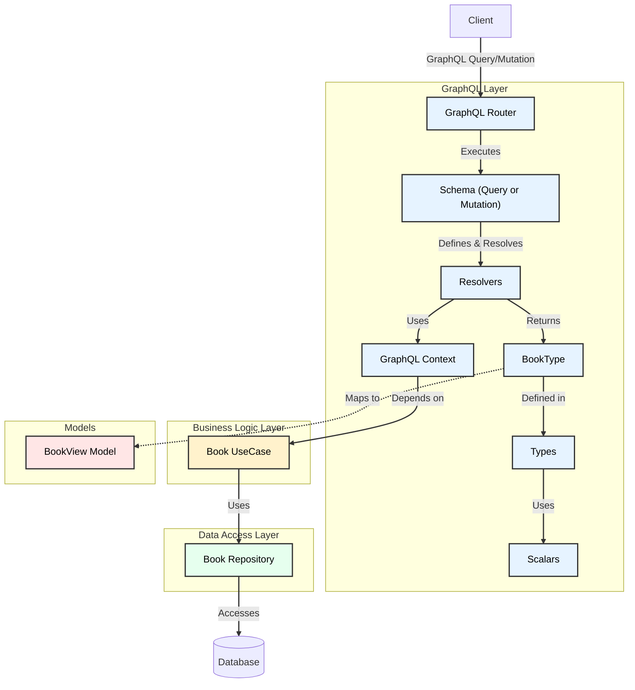

# GraphQL memo

## GUI

<http://localhost:30020/graphql>

## GraphQLのフロー

GraphQL、REST併用することを想定しているので、usecaseやmodel、repositoryを経由する。
"Book"に対してQuery/Mutationを行う場合のフロー。

## ざっくりメモ

- **クエリ (Query)** 
  データを取得するためのリクエスト 
  クライアントが必要なデータの構造を指定し、その構造に基づいてサーバーからデータが返される

- **ミューテーション (Mutation)** 
  データを変更するためのリクエスト 
  新しいデータの作成、既存データの更新、削除などが含まれる

- **サブスクリプション (Subscription)** 
  特定のイベントが発生した際に、クライアントにリアルタイムで通知を送信する仕組み 
  主にチャットアプリや通知機能で利用される

- **スキーマ (Schema)** 
  GraphQL APIの仕様を定義するもの 
  どのようなデータ型が存在し、それらがどのように関連しているかを示す 
  スキーマは型システムに基づいており、APIの設計を明確にする

- **型 (Type)** 
  GraphQLで使用されるデータ型 
  基本的なスカラー型（String, Int, Float, Boolean, ID）やオブジェクト型などがある

- **リゾルバ (Resolver)** 
  特定のフィールドに対してデータを取得するための関数 
  リゾルバはスキーマで定義されたフィールドに基づいて実行される
